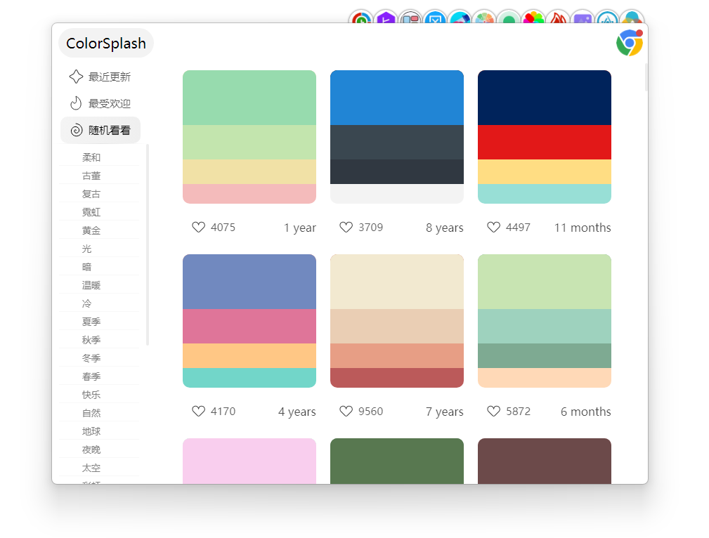

# [官网地址](http://47.92.72.10/)

## 办公助理
uhelper是一款全能办公应用，不仅提供基础文件管理、截图、剪贴板管理等多个实用功能，同时还接入AI智能助理，让工作更简易高效。

## 极速应用

用户可通过搜索框，快捷指令或导航板快速打开应用，且秒开！

## 丰富应用

内置商店容纳丰富多样的工具，满足日常办公使用，且持续上架中...

## 系统适配进度
| Window   | Mac   | Linux   |
|-------|-------|-------|
| win7,win8.1,win10,win11 | 正在进行 | 计划中 |
